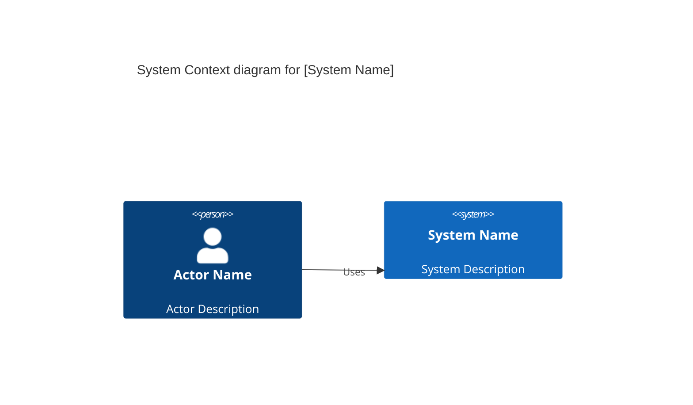
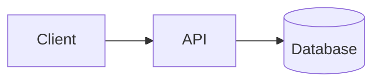

# Technology & Architecture

## Architecture Diagram

<!-- For C4 Level 1 (Context), use:
     - Person: actors/users
     - System: the system being built and external systems
-->

## Technology Research

Before selecting technologies, research current best-in-class options for each
category using web search. Prefer established, actively maintained projects and
managed services over custom implementations where they fit.

### Options Evaluated

| Category | Options Considered | Selected | Rationale |
|----------|--------------------|----------|-----------|
| Language | | | |
| Framework | | | |
| Database | | | |
| Infrastructure | | | |

### Build vs Buy vs Use

Evaluate managed services and SaaS before building custom solutions:

| Need | Evaluated Options | Decision | Reason |
|------|-------------------|----------|--------|
| | | Build / Buy / Use | |

## Technology Stack

| Category | Technology | Version | Rationale |
|----------|------------|---------|-----------|
| Language |            |         |           |
| Framework |          |         |           |
| Database |           |         |           |
| Infrastructure |    |         |           |
| CI/CD |             |         |           |
| Monitoring |         |         |           |

## Infrastructure Overview

<!-- Describe deployment environment, cloud provider, etc. -->

## System Components

| Component | Responsibility | Technology |
|-----------|---------------|------------|
|           |               |            |

## Data Architecture

### Data Stores

| Store | Purpose | Technology |
|-------|---------|------------|
|       |         |            |

### Data Flows

## Security Considerations

- 
- 

## Non-Functional Requirements

| Requirement | Target | Measurement |
|-------------|--------|-------------|
| Performance |        |             |
| Availability |       |             |
| Scalability |        |             |

## 12-Factor App Compliance

Design decisions must address each factor. Document the approach for this project.

| Factor | Requirement | Approach |
|--------|-------------|----------|
| I. Codebase | One codebase, many deploys | |
| II. Dependencies | Explicitly declare and isolate all dependencies | |
| III. Config | Store config in environment variables, never in code | |
| IV. Backing Services | Treat databases, queues, caches as attached resources | |
| V. Build, Release, Run | Strictly separate build and run stages | |
| VI. Processes | Stateless processes; persist state in backing services | |
| VII. Port Binding | Export services via port binding, not web server injection | |
| VIII. Concurrency | Scale out via the process model | |
| IX. Disposability | Fast startup, graceful shutdown, resilience to sudden death | |
| X. Dev/Prod Parity | Keep dev, staging, and production as similar as possible | |
| XI. Logs | Treat logs as event streams; never route or store in app | |
| XII. Admin Processes | Run admin/management tasks as one-off processes | |
