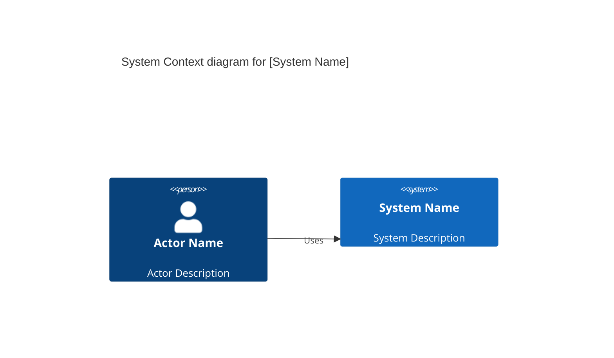
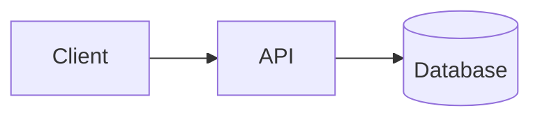

# Technology & Architecture

## Architecture Diagram

<!-- For C4 Level 1 (Context), use:
     - Person: actors/users
     - System: the system being built and external systems
-->

## Technology Stack

| Category | Technology | Version | Rationale |
|----------|------------|---------|-----------|
| Language |            |         |           |
| Framework |          |         |           |
| Database |           |         |           |
| Infrastructure |    |         |           |
| CI/CD |             |         |           |
| Monitoring |         |         |           |

## Infrastructure Overview

<!-- Describe deployment environment, cloud provider, etc. -->

## System Components

| Component | Responsibility | Technology |
|-----------|---------------|------------|
|           |               |            |

## Data Architecture

### Data Stores

| Store | Purpose | Technology |
|-------|---------|------------|
|       |         |            |

### Data Flows

## Security Considerations

- 
- 

## Non-Functional Requirements

| Requirement | Target | Measurement |
|-------------|--------|-------------|
| Performance |        |             |
| Availability |       |             |
| Scalability |        |             |
